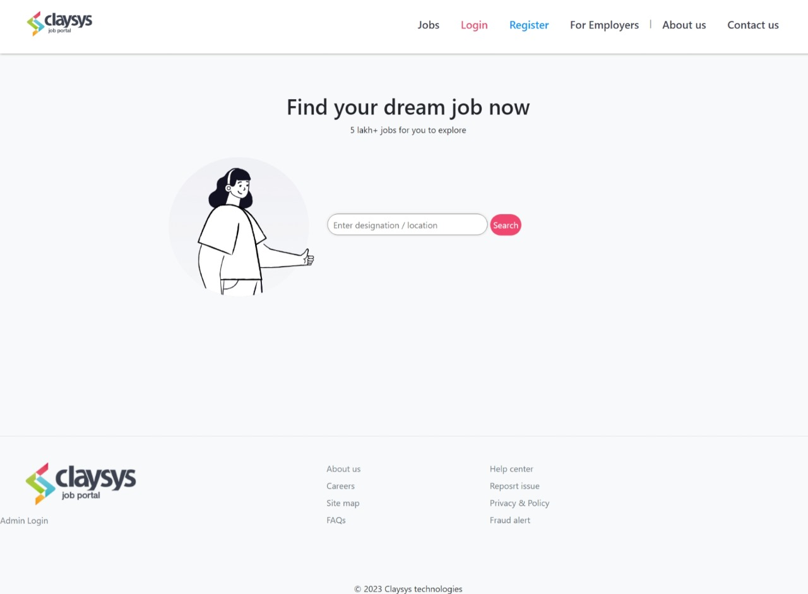
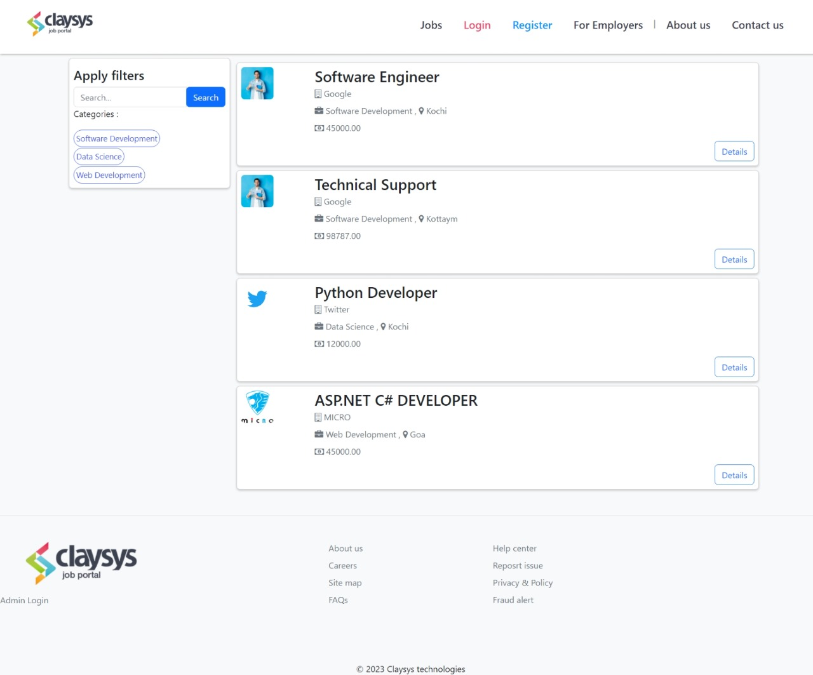
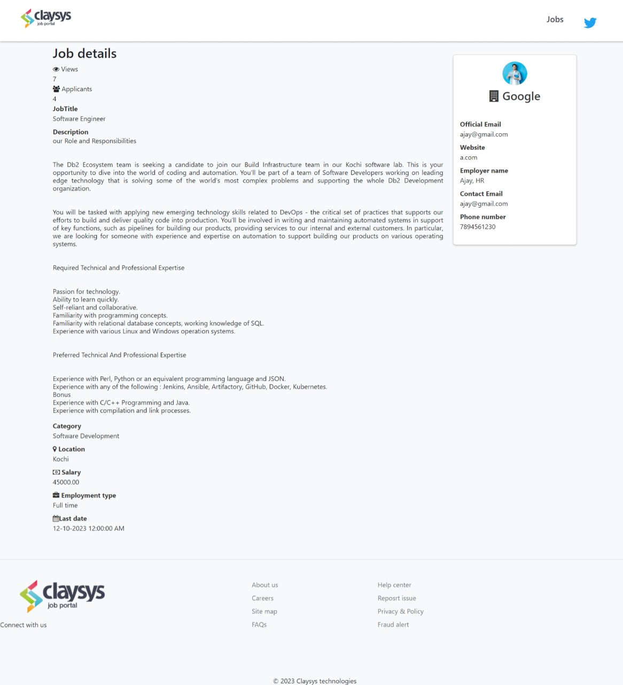
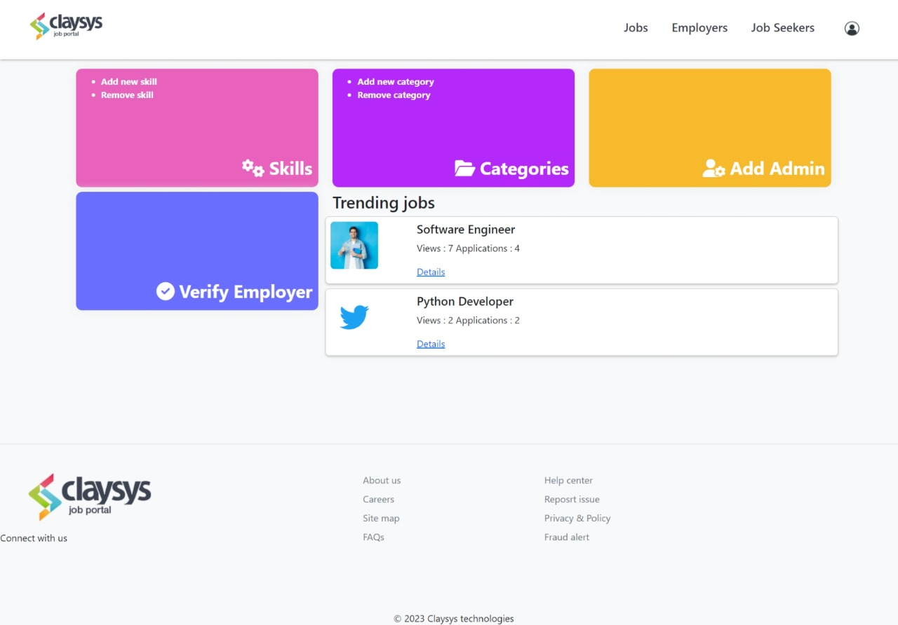
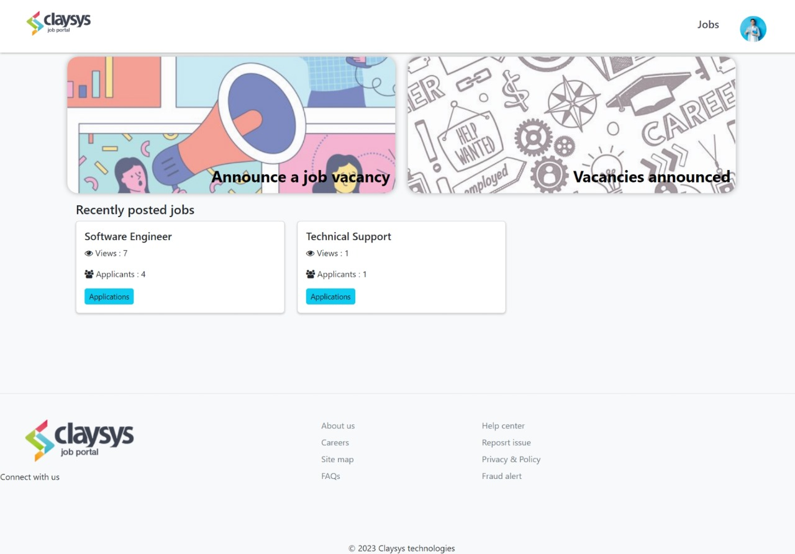
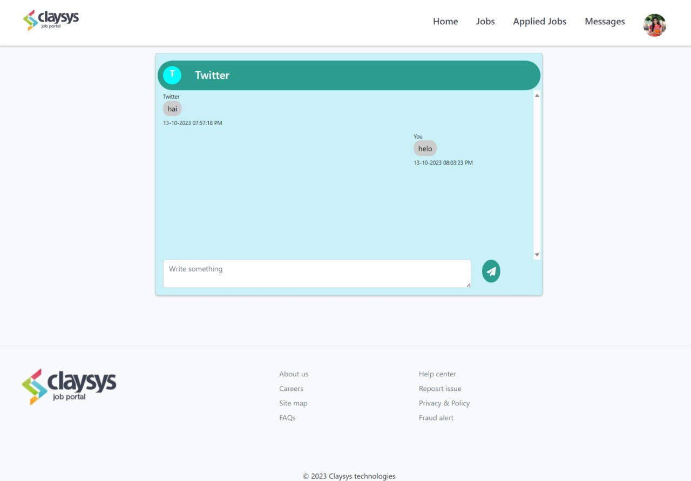

# 💼 Job Portal Web Application

A dynamic Job Portal Web Application built using ASP.NET MVC that connects job seekers and employers. It helps users search for jobs, apply easily, and manage recruitment efficiently.

---

## 🚀 Features

- 👤 **User Roles**
  - Job Seekers
  - Employers

- 🔍 **Job Listings**
  - Browse and search jobs
  - Filter by category, location, etc.

- 📄 **Job Applications**
  - Apply with resume and cover letter
  - Employers can review and manage applications

- ⭐ **Bookmarks**
  - Save jobs for later

- 🧑‍💼 **User Profiles**
  - Manage personal, education, and work details

- 🎓 **Education Details**
  - Add school, degree, GPA, and more

- 🔐 **Authentication**
  - Secure login and registration

- 💬 **Real-time Chat**
  - Communication between job seekers and employers

- 📱 **Responsive Design**
  - Works on mobile, tablet, and desktop

---

## 🎯 Project Goals

- Simplify job searching and hiring
- Provide a clean and user-friendly experience
- Improve communication between users
- Ensure secure and reliable platform

---

## 🛠️ Tech Stack

- ASP.NET MVC
- C#
- SQL Server
- HTML, CSS, JavaScript

---

## 📸 Screenshots

  
  
  
  
  

---

## 📌 Conclusion

This application bridges the gap between job seekers and employers by making the hiring process simple, efficient, and user-friendly.